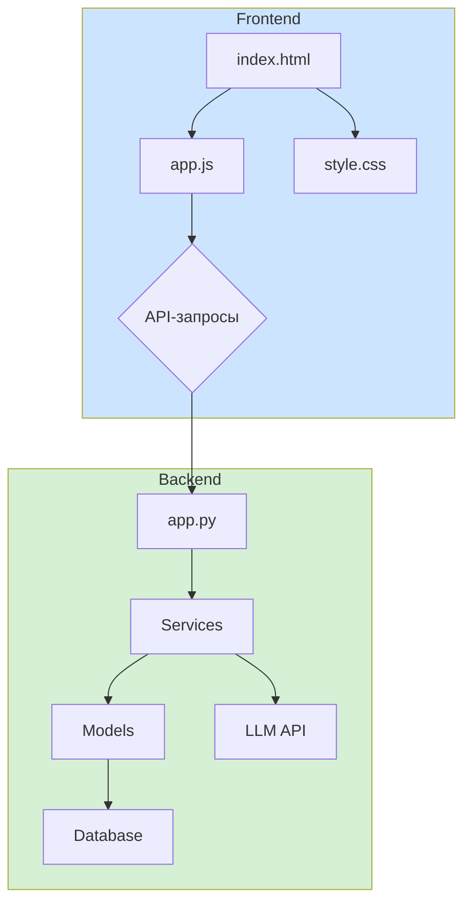

# Документация проекта: Okko AI Movie Assistant

## 1. Обзор проекта

**Okko AI Movie Assistant** — это интеллектуальный ассистент, созданный для помощи пользователям в выборе фильмов и сериалов из каталога Okko. Ассистент использует диалоговый интерфейс для анализа предпочтений пользователя, учитывая его настроение, контекст (время суток, погода) и социальную ситуацию (просмотр в одиночку, с друзьями).

## 2. Архитектура

Проект состоит из двух основных частей: **Frontend** (клиентское приложение) и **Backend** (серверное приложение).

- **Frontend**: Одностраничное приложение (SPA), написанное на чистом JavaScript, HTML и CSS. Отвечает за пользовательский интерфейс, отправку запросов на бэкенд и отображение рекомендаций.
- **Backend**: RESTful API на Flask (Python), которое обрабатывает логику, взаимодействует с базой данных, внешними API (LLM, погода) и генерирует рекомендации.

## 3. Backend

Бэкенд построен на микросервисной архитектуре, где каждый компонент отвечает за свою часть логики.

### `app.py`

Основной файл приложения Flask. Он определяет следующие эндпоинты:

- `/api/health`: Проверка состояния сервера.
- `/api/context`: Получение контекстной информации (время, погода).
- `/api/chat`: Основной эндпоинт для общения с ассистентом.
- `/api/chat/stream`: Эндпоинт для потоковой передачи ответов от LLM.
- `/api/recommendations`: Получение рекомендаций без чата.

### `config.py`

Файл конфигурации. Содержит все настройки для подключения к базе данных, API-ключи, веса для алгоритмов и другие параметры.

### `requirements.txt`

Список всех Python-зависимостей, необходимых для работы бэкенда.

### Директория `services/`

Содержит основную бизнес-логику.

- `llm_service.py`: Интеграция с OpenRouter API для взаимодействия с LLM (например, Claude 3 Sonnet).
- `context_service.py`: Определяет контекст пользователя (время суток, день недели, погода).
- `recommendation_engine.py`: Главный сервис, который генерирует рекомендации, объединяя данные из базы, контекст и настроение пользователя.

### Директория `models/`

Отвечает за взаимодействие с данными.

- `database.py`: Менеджер для работы с базой данных PostgreSQL. Содержит методы для поиска фильмов по жанрам, названию и другим фильтрам.
- `embeddings.py`: Управляет созданием и кэшированием векторных представлений (эмбеддингов) для семантического поиска.

### Директория `utils/`

Вспомогательные утилиты.

- `mood_detector.py`: Детектор настроения, который анализирует текст пользователя с помощью ключевых слов и сентимент-анализа.
- `prompts.py`: Шаблоны промптов для общения с LLM.

## 4. Frontend

Клиентская часть проекта, с которой взаимодействует пользователь.

### `index.html`

Основная HTML-страница, содержащая всю структуру интерфейса: шапку, боковую панель, окно чата и поле ввода.

### `style.css`

Файл стилей, который определяет внешний вид приложения. Включает в себя адаптивный дизайн для мобильных устройств и поддержку темной/светлой темы.

### `app.js`

Основной JavaScript-файл, который управляет всей логикой на стороне клиента:

- Инициализация компонентов интерфейса.
- Обработка событий (отправка сообщений, клики по кнопкам).
- Отправка AJAX-запросов на бэкенд.
- Отображение сообщений и карточек с рекомендациями.
- Управление состоянием сессии и контекста.

## 5. Установка и запуск

### Backend

1. Перейдите в директорию `backend`.
2. Создайте виртуальное окружение: `python -m venv venv`
3. Активируйте его: `source venv/bin/activate` (для macOS/Linux) или `venv\Scripts\activate` (для Windows).
4. Установите зависимости: `pip install -r requirements.txt`.
5. Создайте файл `.env` на основе `.env.example` и укажите ваши API-ключи.
6. Запустите сервер: `flask run`.

### Frontend

1. Перейдите в директорию `frontend`.
2. Напишите npm install;
3. Для запуска используйте npm start. Фронт откроется на `http://localhost:3000/`

## 6. Ключевые особенности

- **Контекстуальные факторы**: Рекомендации адаптируются под время суток, погоду, день недели и настроение пользователя.
- **LLM-агент**: Ассистент использует многошаговую логику, задает уточняющие вопросы и запоминает контекст диалога.
- **Гибридный движок рекомендаций**: Система использует комбинацию контентного, коллаборативного и контекстуального подходов для подбора фильмов.
- **Семантический поиск**: Векторные эмбеддинги используются для поиска фильмов по смысловой близости к запросу пользователя.
